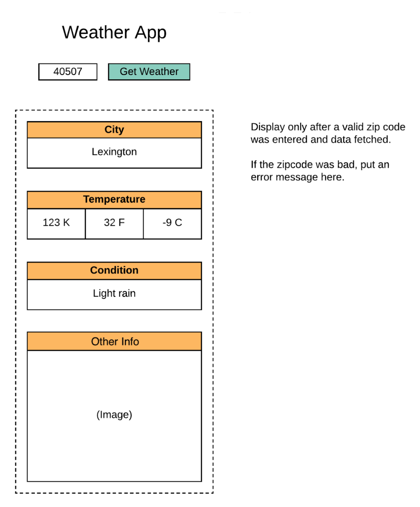

# **Weather App**

The purpose of this project is to become familiar with APIs, NPM, Axios, Async, and Await.

  

  

[Here is the finished project . . .](https://chad-powellv1.github.io/weather-app/)
