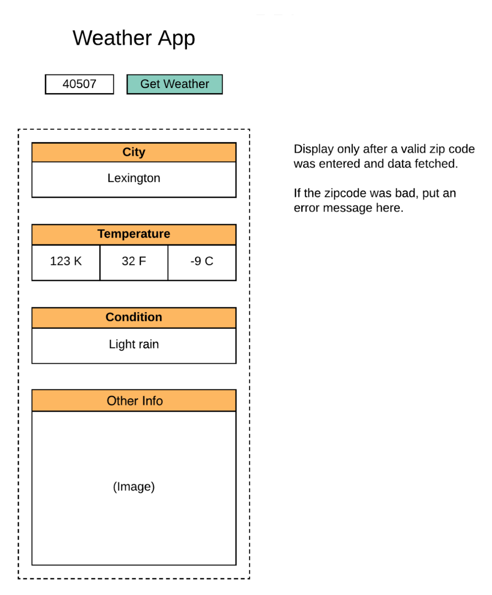

# **Weather App**

<br/>

## **Wireframe**:



<br/><br/>

## **Important Items to Remember**:

  - Validate zipcode entry
    - Proper length and not empty
    - Integers only
    - Prevent API call if not valid

  - Only show Title, zipcode field, and get Weather Button on start

  - If API error, display modal popup
    - Create an exit button to close modal
    - Allow end-user to hit Escape key to close modal
    - Allow end-user to mouse click outside of modal to close modal

  - Remove previous weather data when end-user clicks inside the zipcode entry field
<hr>
<br/>

## **Objects**:
<br/>

  - ### **Views**:

    - #### **View 0**:
      - Weather App title
      - Zipcode form field
      - Get weather button

    - #### **View 1**:
      - City label
        - City data field

      - Temperature label
        - Kelvin data field
        - Fahrenheit data field
        - Celsius data field

      - Current Conditions label
        - Condition data field

      - Weekly Forecast label
        - Forecast data fields

      - Image field data

    - #### **View 2**:
      - Modal Title 
      - Modal exit button
      - Modal error message
<hr>

<br/><br/>

```
START

INIT
    Get app element from DOM
    Create h1 element
    Create zipcode form element
    Create getWeatherBtn
    Create city element and city data field
    Create Temperature element and data fields
    Create Current Conditions element and data field
    Create Weekly Forecast element and data field
    Create Image field
    Create Modal element
    Create click handler for getWeatherBtn
    Create onFocus listener for zipcode element
    Create an array to hold recently searched zipcode
    Create variable to hold current zipcode to control state
    Create variable to hold error to control error state
    Create weatherLink variable to hold API link & key

FUNCTIONS

    getWeather =>
      - Fetches weather data from openweathermap.org
      - Sets data from API to specific variables
      - Catches any errors and displays triggers a modal popup 
        to display to end-user

    zipcodeValidation =>
      - Only allow getWeather to run IF
        - Zipcode is 5 digits long and it is a number
        - If not Modal will display an error

    updateState =>
      - If API call is good display weather data


